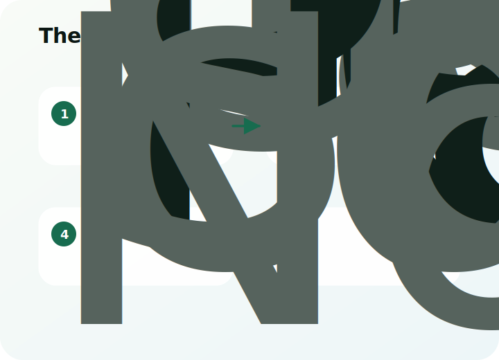
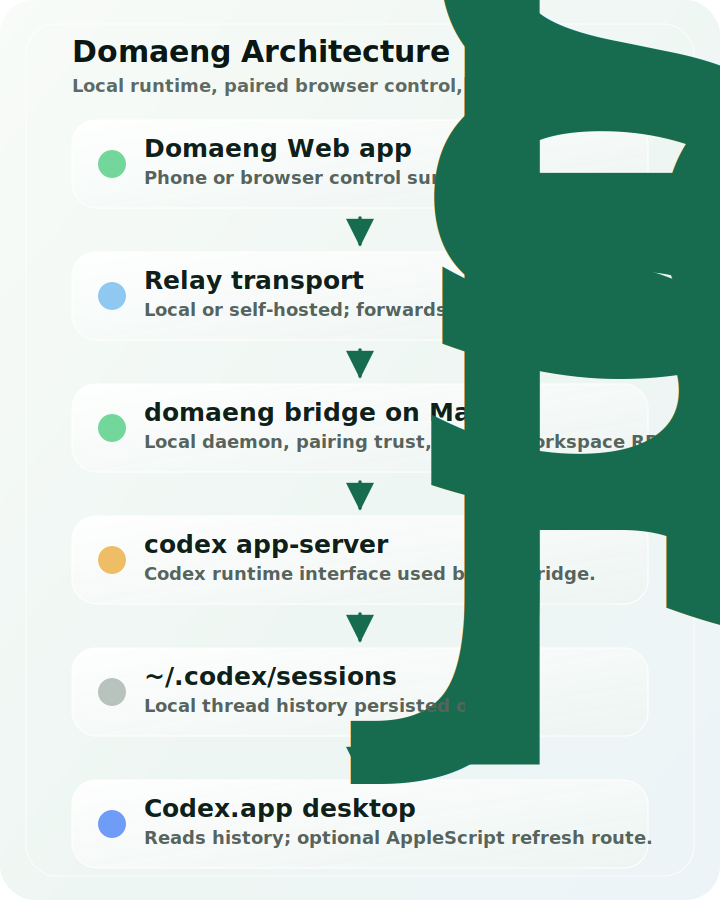

<p align="center">
  
</p>

# Domaeng

[中文说明](README.zh-CN.md)

[](LICENSE)

Domaeng lets you control [Codex](https://openai.com/index/codex/) from any paired browser while Codex keeps running on your Mac.

Your Mac is the host. Your phone, tablet, laptop, or desktop browser is the remote control. The relay is only the transport layer.

> **This project is still early. Expect bugs.**
>
> The public repo is local-first and self-host friendly. It does not ship with a private hosted relay baked in.

## What It Is

- **Mac-hosted Codex**: Codex, git commands, workspace reads/writes, and thread history stay on your Mac.
- **Any-device web app**: use the same Web App from iOS, Android, another laptop, the same Mac, or an installed PWA.
- **Local-first connection**: run the relay locally or self-host it on infrastructure you control.
- **Pair once, reconnect later**: trust a Mac with QR or pairing code, then reconnect when that bridge is reachable.

<p align="center">
  
</p>

## Install

Install the bridge CLI on the Mac that will host Codex:

```sh
npm install -g domaeng@latest
domaeng up
```

Run this on the Mac that will host Codex. The npm package includes the bridge, local relay, and Web App assets. `domaeng up` starts the local relay and bridge service, then prints the URL / QR information for the Web App.

On the other device, open the Web App URL served at `/app/`, then pair by QR code or pairing code.

You do **not** need a separate mobile app download. The browser is the client.

## Requirements

- A Mac that will run Codex and the Domaeng bridge
- Node.js 18+
- npm available in your shell
- Codex CLI installed and available in your `PATH`
- A browser on any device that can reach your relay or private network

`Codex.app` is optional. Domaeng can share local thread history with it, but the Web App controls the bridge directly.

## Choose Your Path

You do not need to read every document before trying Domaeng. Start with the path that matches your setup:

| Goal | Start here |
| --- | --- |
| Install Domaeng for the first time | [Getting started](Docs/getting-started.md) |
| Use a phone or tablet away from the Mac's Wi-Fi | [Tailscale setup](Docs/tailscale.md) |
| Understand each button and operation | [Operations guide](Docs/operations.md) |
| Run your own relay or reverse proxy | [Self-hosting guide](Docs/self-hosting.md) |
| See every command and environment variable | [Advanced reference](Docs/reference.md) |

## What You Can Do

- Start, steer, stop, and resume Codex runs from the Web App
- Queue follow-up prompts while a turn is still running
- Watch live streaming output from the Mac-hosted runtime
- Use Fast / Standard mode, Plan mode, reasoning controls, and access controls
- Send image attachments
- Trigger local git actions such as status, commit, push, pull, and branch switching
- Receive browser notifications when turns finish or need attention
- Reconnect to the same trusted Mac after the first pairing

## How It Works

<p align="center">
  
</p>

1. Run `domaeng up` on the Mac that hosts Codex.
2. Open the relay-served Web App from any device.
3. Pair once with QR or pairing code.
4. The browser sends encrypted instructions to the Mac bridge.
5. The bridge talks to Codex and performs local workspace / git actions on the Mac.
6. The Web App receives live output and can reconnect later to the trusted Mac.

## Common Paths

### Normal Use

```sh
npm install -g domaeng@latest
domaeng up
```

Use the URL and QR printed by the CLI. This is the easiest path for most first-time users because the npm package provides the local relay and Web App assets for you.

For a step-by-step first run, see [Getting started](Docs/getting-started.md).

### Existing Relay

```sh
DOMAENG_RELAY="wss://your-relay.example.com/relay" domaeng up
```

Use this when you already have a reachable relay, Tailscale endpoint, or reverse proxy.

### Source CLI

```sh
git clone https://github.com/hhaajack/domaeng.git
cd domaeng
npm install -g ./phodex-bridge
domaeng up
```

Use this when you are developing from a checkout and specifically want the local source version of the `domaeng` command.

For cross-device use, Tailscale or another stable private network is usually smoother than plain LAN routing. See [Tailscale setup](Docs/tailscale.md).

### Self-Host The Relay

Use this when you want the relay on your own VPS or private network:

- [Self-hosting guide](Docs/self-hosting.md)
- [Public source model](SELF_HOSTING_MODEL.md)

## Project Map

| Path | Purpose |
| --- | --- |
| `phodex-bridge/` | Node.js bridge package behind the `domaeng` CLI |
| `web/` | React + Vite Web/PWA client served at `/app/` |
| `relay/` | Self-hostable WebSocket relay and optional push endpoints |
| `Docs/` | Beginner guides, operation guides, self-hosting notes, and advanced reference docs |

## More Detail

The front page is intentionally short. Use these when you need the deeper knobs:

- [Getting started](Docs/getting-started.md): first install, first pairing, and first successful Codex run
- [Tailscale setup](Docs/tailscale.md): private cross-device access without hardcoded hosted-service assumptions
- [Operations guide](Docs/operations.md): what the Web App, bridge, pairing, trusted devices, and git actions do
- [Advanced reference](Docs/reference.md): commands, environment variables, security notes, integrations, source build notes
- [Self-hosting guide](Docs/self-hosting.md): local LAN, VPS relay, reverse proxy, troubleshooting
- [Self-hosting model](SELF_HOSTING_MODEL.md): why public source builds stay local-first and generic

## Current Packaging Status

- Public npm package: includes the bridge CLI, local relay, and Web App assets; install with `npm install -g domaeng@latest`
- Source checkout launcher: available with `./run-local-domaeng.sh` for development and local source testing
- Local source bridge CLI: installable from a checkout with `npm install -g ./phodex-bridge`
- Web App: served by the bridge / relay at `/app/`
- Mobile app: no separate download; use the browser or installed PWA

## Relationship To Remodex

Domaeng is based on [Remodex](https://github.com/Emanuele-web04/remodex), originally created by Emanuele Di Pietro.

This repository keeps the original Apache-2.0 license and attribution while continuing the work under the Domaeng public name, package name, and app branding. The upstream Remodex README states that the Remodex name, marks, and branding are not licensed for forks or derivative projects; Domaeng uses its own name and branding for that reason.

The codebase still contains some Remodex-era names, including internal file names, CLI entry files, protocol fields, and legacy state paths such as `~/.remodex`. Those names are kept intentionally so existing local installs, pairing state, and migration paths do not break.

For users, the thing to install and run is `domaeng`. You do not need to install a separate Remodex package.

## Contributing

I am not actively accepting contributions yet. If you still want to help, read [CONTRIBUTING.md](CONTRIBUTING.md) first.

## License

Apache-2.0. See [NOTICE](NOTICE) for attribution.
