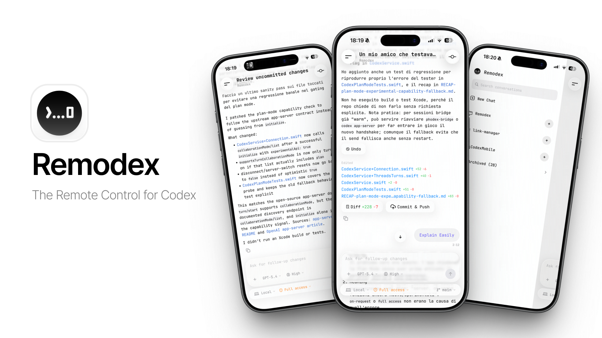

<p align="center">
  
</p>

# Domaeng

[](https://www.npmjs.com/package/domaeng)
[](LICENSE)

Control [Codex](https://openai.com/index/codex/) from a paired browser. Domaeng is a local-first open-source bridge + web app + self-hostable relay that keeps the Codex runtime on your Mac and lets another device connect through a secure session.

## Key Features

- End-to-end encrypted pairing and chats between your browser and Mac
- Fast mode for lower-latency turns
- Plan mode for structured planning before execution
- Subagents from the web app with the `/subagents` command
- Steer active runs without starting over
- Queue follow-up prompts while a turn is still running
- Web notifications when turns finish or need attention
- Git actions from the web app, including commit, push, pull, and branch switching
- Reasoning controls to tune how much thinking Codex uses
- Access controls with On-Request and auto-review modes
- Image attachments
- One-time QR bootstrap with trusted Mac reconnects
- macOS-only background bridge service via `launchd`
- Live streaming in the browser while Codex runs on your Mac
- Shared thread history with Codex on your Mac

The repo stays local-first and self-host friendly: the web app and bridge do not require a public hosted endpoint, and the transport layer remains inspectable for anyone who wants to run their own setup.

Some internal file names, protocol fields, and legacy state paths still use `remodex` or `phodex` names for upstream compatibility. `Domaeng` is the public distribution name for this source release.

Today, the background daemon / trusted auto-reconnect flow is implemented for macOS. Self-hosted relay setups still work on other OSes, but they currently use the foreground bridge flow instead of the macOS `launchd` service path.

If you want the public-repo distribution model explained clearly, read [SELF_HOSTING_MODEL.md](SELF_HOSTING_MODEL.md).

> **I am very early in this project. Expect bugs.**
>
> I am not actively accepting contributions yet. If you still want to help, read [CONTRIBUTING.md](CONTRIBUTING.md) first.

## Web App

Domaeng Web is the primary client for this source distribution. Build it with:

```sh
cd web
npm install
npm run build
```

The relay serves the built app from `/app/`. Pair by scanning the QR from the web app or by entering the pairing code printed by `domaeng up`.

This repository still contains the historical `CodexMobile/` Xcode project, but the current release path is the web app plus `domaeng` bridge. Treat the iOS code as legacy unless you explicitly choose to maintain it.

## Architecture

```
┌──────────────┐       Paired session   ┌───────────────┐       stdin/stdout       ┌─────────────┐
│ Domaeng Web │ ◄────────────────────► │ domaeng (Mac) │ ◄──────────────────────► │ codex       │
│ app         │    WebSocket bridge    │ bridge        │    JSON-RPC              │ app-server  │
└──────────────┘                        └───────────────┘                          └─────────────┘
                                               │                                         │
                                               │  AppleScript route bounce                │ JSONL rollout
                                               ▼                                         ▼
                                        ┌─────────────┐                           ┌─────────────┐
                                        │  Codex.app  │ ◄─── reads from ──────── │  ~/.codex/  │
                                        │  (desktop)  │      disk on navigate     │  sessions   │
                                        └─────────────┘                           └─────────────┘
```

1. Run `domaeng up` on your Mac
2. On macOS, Domaeng installs/starts a lightweight background bridge service and prints a QR for first-time pairing or recovery
3. Open the web app served by the relay, then scan the QR or enter the pairing code once to trust that Mac
4. After the first handshake, the web app can resolve the Mac's live session through the configured relay and reconnect automatically
5. Your browser sends instructions to Codex through the bridge and receives responses in real-time
6. The bridge handles git operations and local session persistence on your Mac
7. `Codex.app` can read the same thread history from disk, but it is not a true live mirror unless you enable the optional refresh workaround

## Repository Structure

This repo contains the local bridge, web client, self-hostable relay, and a legacy iOS target:

```
├── phodex-bridge/                # Node.js bridge package used by `domaeng`
│   ├── bin/                      # CLI entrypoints
│   └── src/                      # Bridge runtime, git/workspace handlers, refresh helpers
├── web/                          # React + Vite web/PWA client served by the relay at /app/
├── relay/                        # Self-hostable WebSocket relay and optional push endpoints
└── CodexMobile/                  # Legacy Xcode project, not the current release path
```

## Prerequisites

- **Node.js** v18+
- **[Codex CLI](https://github.com/openai/codex)** installed and in your PATH
- **[Codex desktop app](https://openai.com/index/codex/)** (optional — for viewing threads on your Mac)
- **macOS** (for desktop refresh features — the core bridge works on any OS)
- **Xcode 16+** only if you choose to work on the legacy iOS project

## Install the Bridge

<sub>Install from npm with `@latest` so you get the newest bridge fixes.</sub>

If you plan to use the macOS menu bar companion, `domaeng` must be installed globally and available in your login-shell `PATH`.

```sh
npm install -g domaeng@latest
```

To update an existing global install later:

```sh
npm install -g domaeng@latest
```

If you only want to try Domaeng, you can install it from npm and run it without cloning this repository.

## Quick Start

Install the bridge, then run:

```sh
domaeng up
```

On first connect, open the relay-served web app at `/app/`, follow the pairing flow, then scan the QR code or enter the pairing code.

After that first scan:

- the browser saves the Mac as a trusted device for that origin
- the Mac bridge keeps its identity locally
- the web app tries trusted reconnect automatically on later launches
- the QR remains available as a recovery path if trust changes or the relay cannot resolve the live session

For now, the daemon-backed trusted reconnect path is macOS-only. If you self-host on Linux or Windows, pairing still works, but the bridge runs in the foreground unless you set up your own OS-specific service wrapper.

## Run Locally

```sh
git clone https://github.com/your-org/domaeng.git
cd domaeng
./run-local-domaeng.sh
```

That launcher starts a local relay, points the bridge at `ws://<your-host>:9000/relay` by default, and prints the pairing QR for the web app.

For cross-device self-hosting, the recommended path is Tailscale or another stable private network. Plain LAN pairing over `ws://<lan-ip>` on the same Wi-Fi is still available for local testing, but it can be unreliable on some mobile browsers even when the relay and Wi-Fi are healthy.

Options:

- `./run-local-domaeng.sh --hostname <lan-hostname-or-ip>`
- `./run-local-domaeng.sh --relay-url https://<random>.trycloudflare.com`
- `./run-local-domaeng.sh --bind-host 127.0.0.1 --port 9100`

If another device is pairing over LAN, use a hostname or IP that device can actually reach.

For a temporary Cloudflare Tunnel, run this in one terminal:

```sh
cloudflared tunnel --url http://127.0.0.1:9000
```

Then pass the generated `https://<random>.trycloudflare.com` URL to the local launcher in another terminal:

```sh
./run-local-domaeng.sh --relay-url https://<random>.trycloudflare.com
```

The launcher advertises that as `wss://<random>.trycloudflare.com/relay` in the pairing QR while keeping the relay process local.

## Custom Relay Endpoint

For a full public self-hosting walkthrough, see [`Docs/self-hosting.md`](Docs/self-hosting.md).

If you want the npm bridge to point at your own setup instead of the package default, override `DOMAENG_RELAY` explicitly:

```sh
DOMAENG_RELAY="ws://localhost:9000/relay" domaeng up
```

For cross-device self-hosted usage, prefer a relay URL reachable over Tailscale or another stable private network. Treat plain local `ws://192.168.x.x` pairing as best-effort rather than the recommended production path on mobile browsers.

A common private setup looks like this:

1. Run the relay on your Mac, a mini server, or a VPS you control
2. Put that machine on Tailscale
3. Set `DOMAENG_RELAY` to the Tailscale-reachable `ws://` or `wss://` relay URL
4. Pair once with QR
5. Let the web app reconnect to the same trusted Mac over that relay later

If that relay is fronting a Mac bridge, the macOS daemon can keep the bridge alive for hands-free reconnects. If you self-host against a non-macOS bridge, the same relay path still works, but automatic background service management is not built in yet.

Reverse-proxy subpaths work too, so a hosted relay behind Traefik can live under the same domain as other APIs:

```sh
DOMAENG_RELAY="wss://api.example.com/domaeng/relay" domaeng up
```

In that setup, the public endpoints can look like this:

- `wss://api.example.com/domaeng/relay`
- `https://api.example.com/domaeng/v1/push/session/register-device`
- `https://api.example.com/domaeng/v1/push/session/notify-completion`

Have the proxy strip `/domaeng` before forwarding so the relay still receives `/relay/...` and `/v1/push/...`.

If you point `DOMAENG_RELAY` at your own self-hosted relay, managed push stays off unless you also set `DOMAENG_PUSH_SERVICE_URL` on the bridge and explicitly enable push on the relay.

## Commands

### `domaeng up`

Starts Domaeng.

On macOS, `domaeng up` is the friendly entrypoint for the background bridge service:

- Writes the daemon config used by the `launchd` service
- Starts or restarts the background bridge service
- Waits for a pairing payload and prints a QR for first-time trust or recovery
- Keeps the bridge alive even if you close the terminal later

On non-macOS platforms, `domaeng up` runs the bridge in the foreground.

In both cases the bridge:

- Spawns `codex app-server` (or connects to an existing endpoint)
- Connects the Mac bridge to the configured relay
- Forwards JSON-RPC messages bidirectionally
- Handles git commands from the paired client
- Persists the active thread for later resumption

### `domaeng start`

macOS only. Starts the background bridge service without waiting for or printing a QR in the current terminal.
If the service is already loaded, this path refreshes it in place.

### `domaeng restart`

macOS only. Explicitly restarts the background bridge service without waiting for or printing a QR in the current terminal.

### `domaeng stop`

macOS only. Stops the background bridge service and clears its transient runtime status.

### `domaeng status`

macOS only. Prints the current `launchd` / bridge status, including whether the service is loaded and whether a recent pairing payload exists.

### `domaeng run-service`

macOS only. Internal service entrypoint used by `launchd`. You normally do not run this manually.

### `domaeng --version`

Prints the installed Domaeng CLI version.

```sh
domaeng --version
# => 1.5.1
```

### `domaeng reset-pairing`

Clears the saved bridge pairing state so the next trusted connection requires a fresh QR bootstrap again.
You normally do not need this for corrupted local state anymore: recent Domaeng builds auto-repair unreadable pairing files/mirrors on startup.

```sh
domaeng reset-pairing
# => [domaeng] Cleared the saved pairing state. Run `domaeng up` to pair again.
```

### `domaeng resume`

Reopens the last active thread in Codex.app on your Mac.

```sh
domaeng resume
# => [domaeng] Opened last active thread: abc-123
```

### `domaeng watch [threadId]`

Tails the event log for a thread in real-time.

```sh
domaeng watch
# => [14:32:01] Client: "Fix the login bug in auth.ts"
# => [14:32:05] Codex: "I'll look at auth.ts and fix the login..."
# => [14:32:18] Task started
# => [14:33:42] Task complete
```

## Environment Variables

`DOMAENG_RELAY` is optional, but the default depends on how you got Domaeng:

- public GitHub/source checkouts stay open-source and self-host friendly, so they do not ship with a hosted relay baked in
- official published packages may include a default relay at publish time
- if you are running from source, assume you should use `./run-local-domaeng.sh` or set `DOMAENG_RELAY` yourself

| Variable | Default | Description |
|----------|---------|-------------|
| `DOMAENG_RELAY` | empty in source checkouts; optional in published packages | Session base URL used for QR bootstrap, trusted-session resolve, and client/Mac session routing |
| `DOMAENG_PUSH_SERVICE_URL` | disabled by default | Optional HTTP base URL for managed push registration/completion |
| `DOMAENG_CODEX_ENDPOINT` | — | Connect to an existing Codex WebSocket instead of spawning a local `codex app-server` |
| `DOMAENG_SHARED_CODEX_RUNTIME` | `true` on macOS | Start the bridge Codex runtime as a localhost WebSocket app-server |
| `DOMAENG_SHARED_CODEX_RUNTIME_PORT` | `0` | Localhost port for the shared Codex runtime (`0` chooses a free port) |
| `DOMAENG_DESKTOP_SHARED_RUNTIME` | `false` | Experimental: relaunch `Codex.app` onto the bridge/shared Codex WebSocket endpoint |
| `DOMAENG_REFRESH_ENABLED` | `false` | Old deep-link refresh fallback for client-authored activity (`true` enables it explicitly) |
| `DOMAENG_REFRESH_DEBOUNCE_MS` | `1200` | Debounce window (ms) for coalescing refresh events |
| `DOMAENG_REFRESH_COMMAND` | — | Custom shell command to run instead of the built-in AppleScript refresh |
| `DOMAENG_CODEX_BUNDLE_ID` | `com.openai.codex` | macOS bundle ID of the Codex app |
| `CODEX_HOME` | `~/.codex` | Codex data directory (used here for `sessions/` rollout files) |

```sh
# Try the experimental Desktop shared-runtime sync path
DOMAENG_DESKTOP_SHARED_RUNTIME=true domaeng up

# Use the old route-refresh fallback
DOMAENG_REFRESH_ENABLED=true domaeng up

# Connect to an existing Codex instance
DOMAENG_CODEX_ENDPOINT=ws://localhost:8080 domaeng up

# Use a custom self-hosted relay endpoint (`ws://` is unencrypted)
DOMAENG_RELAY="ws://localhost:9000/relay" domaeng up

# Enable managed push only if your self-hosted relay also exposes a configured APNs push service
DOMAENG_RELAY="wss://relay.example/relay" \
DOMAENG_PUSH_SERVICE_URL="https://relay.example" \
domaeng up
```

On the relay/VPS side, keep push disabled until you actually want it. The HTTP push endpoints are off by default and only turn on when you set `DOMAENG_ENABLE_PUSH_SERVICE=true`.

## Pairing and Safety

- Domaeng is local-first: Codex, git operations, and workspace actions run on your Mac, while the web app acts as a paired remote control.
- For mobile browsers, the most reliable self-host setup is a Tailscale-reachable relay. Plain LAN pairing over `ws://` on the same Wi-Fi can fail on some devices because local-network routing is not always reliable.
- The pairing QR carries the connection URL, the session ID, and the bridge identity key used to bootstrap end-to-end encryption. After a successful first scan, the web app stores a trusted Mac record in origin-scoped storage and the bridge persists its trusted client identity locally on the Mac.
- On macOS, the bridge can keep running as a lightweight `launchd` service, so the web app can resolve the Mac's current live relay session and reconnect without scanning a new QR every time.
- The QR is still the recovery path when trust changes, the bridge identity rotates, or the relay cannot resolve the current live session.
- The bridge state lives canonically in `~/.domaeng/device-state.json` with local-only permissions. On macOS the bridge also mirrors that state to Keychain as best-effort backup/migration data, and recent builds auto-repair unreadable local state on startup instead of requiring manual cleanup.
- The CLI no longer prints the connection URL in plain text below the QR.
- Set `DOMAENG_RELAY` only when you want to self-host or test locally against your own setup.
- Leave `DOMAENG_TRUST_PROXY` unset for direct/self-hosted installs. Turn it on only when a trusted reverse proxy such as Traefik, Nginx, or Caddy is forwarding the relay traffic.
- The transport implementation is public in [`relay/`](relay/), but your real deployed hostname and credentials should stay private.
- The default agent permission mode is `On-Request`. Enabling auto review in the web app delegates runtime approval prompts to the configured reviewer flow.

## Security and Privacy

Domaeng now uses an authenticated end-to-end encrypted channel between the paired web app and the bridge running on your Mac. The transport layer still carries the WebSocket traffic, but it does not get the plaintext contents of prompts, tool calls, Codex responses, git output, or workspace RPC payloads once the secure session is established.

The secure channel is built in these steps:

1. The bridge generates and persists a long-term device identity keypair on the Mac.
2. The pairing QR shares the connection URL, session ID, bridge device ID, bridge identity public key, and a short expiry window.
3. During pairing, the web app and bridge exchange fresh X25519 ephemeral keys and nonces.
4. The bridge signs the handshake transcript with its Ed25519 identity key, and the web app verifies that signature against the public key from the QR code or the previously trusted Mac record.
5. The web app signs a client-auth transcript with its own Ed25519 identity key, and the bridge verifies that before accepting the session.
6. Both sides derive directional AES-256-GCM keys with HKDF-SHA256 and then wrap application messages in encrypted envelopes with monotonic counters for replay protection.

Privacy notes:

- The transport layer can still see connection metadata and the plaintext secure control messages used to set up the encrypted session, including session IDs, device IDs, public keys, nonces, and handshake result codes.
- The transport layer does not see decrypted application payloads after the secure handshake succeeds.
- A fresh QR scan trusts that browser or mobile install without invalidating other trusted devices. Use `domaeng reset-pairing` only when you intentionally want to wipe the remembered pairing state yourself.
- Browser-side trusted state is stored per origin in IndexedDB.

## Git Integration

The bridge intercepts `git/*` JSON-RPC calls from the paired client and executes them locally:

| Command | Description |
|---------|-------------|
| `git/status` | Branch, tracking info, dirty state, file list, and diff |
| `git/commit` | Commit staged changes with an optional message |
| `git/push` | Push to remote |
| `git/pull` | Pull from remote (auto-aborts on conflict) |
| `git/branches` | List all branches with current/default markers |
| `git/checkout` | Switch branches |
| `git/createBranch` | Create and switch to a new branch |
| `git/log` | Recent commit history |
| `git/stash` | Stash working changes |
| `git/stashPop` | Pop the latest stash |
| `git/resetToRemote` | Hard reset to remote (requires confirmation) |
| `git/remoteUrl` | Get the remote URL and owner/repo |

## Workspace Integration

The bridge also handles local workspace-scoped revert operations for the assistant revert flow:

| Command | Description |
|---------|-------------|
| `workspace/revertPatchPreview` | Checks whether a reverse patch can be applied cleanly in the local repo |
| `workspace/revertPatchApply` | Applies the reverse patch locally when the preview succeeds |

## Codex Desktop App Integration

Domaeng works with both the Codex CLI and the Codex desktop app (`Codex.app`). Under the hood, the bridge spawns a `codex app-server` process — the same JSON-RPC interface that powers the desktop app and IDE extensions. Conversations are persisted as JSONL rollout files under `~/.codex/sessions`, so threads started from the web app show up in the desktop app too.

What is live today:

- The web conversation is live while the bridge session is connected.
- On macOS, Domaeng can start the bridge-owned Codex runtime as a localhost WebSocket `codex app-server`.
- Relaunching `Codex.app` onto that shared runtime is still experimental and opt-in with `DOMAENG_DESKTOP_SHARED_RUNTIME=true`.
- When that experimental path is enabled, the goal is for live thread events and approval decisions to flow through the shared runtime instead of waiting for a disk-backed route refresh.

The web app can open matching thread links in `Codex.app` when you want to explicitly switch focus to the Mac.

The old refresh workaround is also available:

```sh
# Enable the old deep-link refresh workaround manually
DOMAENG_SHARED_CODEX_RUNTIME=false DOMAENG_REFRESH_ENABLED=true domaeng up
```

This triggers a debounced deep-link bounce (`codex://settings` → `codex://threads/<id>`) that forces the desktop app to remount the current thread after the turn completes. If the local desktop path is unavailable, the bridge self-disables desktop refresh for the rest of that run instead of retrying noisily forever.

## Connection Resilience

- **Auto-reconnect**: If the session connection drops, the bridge reconnects with exponential backoff (1 s → 5 s max)
- **Secure catch-up**: The bridge keeps a bounded local outbound buffer and re-sends missed encrypted messages after a secure reconnect
- **Codex persistence**: The Codex process stays alive across transient session reconnects during the current bridge run
- **Graceful shutdown**: SIGINT/SIGTERM cleanly close all connections

## Legacy iOS Project

The `CodexMobile/` Xcode project remains in the repository for now, but it is not the current release target. Keep it from breaking shared bridge/web workflows, but do not treat iOS as the main supported client for this source distribution.

## Contributing

I'm not actively accepting contributions yet. See [CONTRIBUTING.md](CONTRIBUTING.md) for details.

## FAQ

**Do I need an OpenAI API key?**
Not for Domaeng itself. You need Codex CLI set up and working independently.

**Does this work on Linux/Windows?**
The core bridge client (Codex forwarding + git) works on any OS. Desktop refresh (AppleScript) is macOS-only, and the built-in daemon / trusted auto-reconnect service path is currently macOS-only too.

**What happens if I close the terminal?**
On macOS, the bridge can keep running in the background through `launchd`, so closing the terminal does not stop the trusted reconnect path. On other OSes, the foreground bridge stops when the terminal stops.

**How do I force a fresh QR pairing?**
Run `domaeng reset-pairing`, then start the bridge again with `domaeng up`. You should only need this when you intentionally want to replace the paired client or wipe the remembered pairing.

**Can I connect to a remote Codex instance?**
Yes — set `DOMAENG_CODEX_ENDPOINT=ws://host:port` to skip spawning a local `codex app-server`.

**Why don't my web threads show up in the Codex desktop app immediately?**
Desktop sync is currently opt-in. Set `DOMAENG_DESKTOP_SHARED_RUNTIME=true` to try the shared-runtime path, or `DOMAENG_REFRESH_ENABLED=true` to try the older route-refresh fallback.

**Does Domaeng support true live sync between web and `Codex.app`?**
The experimental macOS shared-runtime path is intended to do that, but it is not the default because it has to relaunch `Codex.app` onto a local WebSocket app-server.

**Can I self-host the relay?**
Yes. That is the intended forking path. The transport and push-service code are in [`relay/`](relay/); point `DOMAENG_RELAY` at the instance you run.

**Can I use Tailscale?**
Yes. It is the recommended private-network option for self-hosting across devices. Run your relay somewhere reachable over Tailscale, set `DOMAENG_RELAY` to that relay URL, pair once with QR, then let the web app reconnect to the trusted Mac through the same relay.

**Is the transport layer safe for sensitive work?**
It is much stronger than a plain text proxy: traffic can be protected in transit with TLS, application payloads are end-to-end encrypted after the secure handshake, and all Codex execution still happens on your Mac. The transport can still observe connection metadata and handshake control messages, so the tightest trust model is to run it yourself.

## License

[Apache License 2.0](LICENSE)

The Domaeng name, marks, and branding are not licensed for use in forks or derivative projects. If you fork, redistribute, or publish a modified version, use a different app name and branding.
