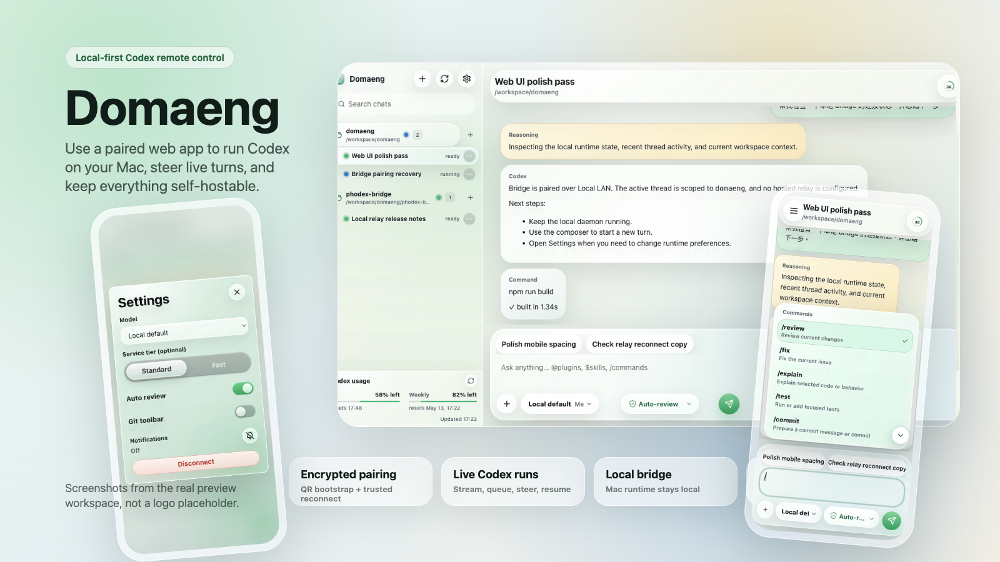
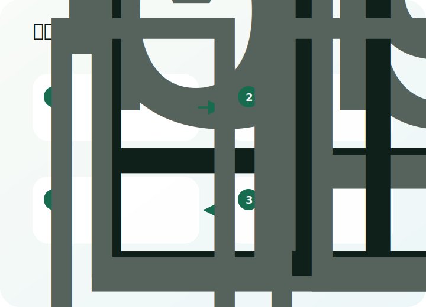
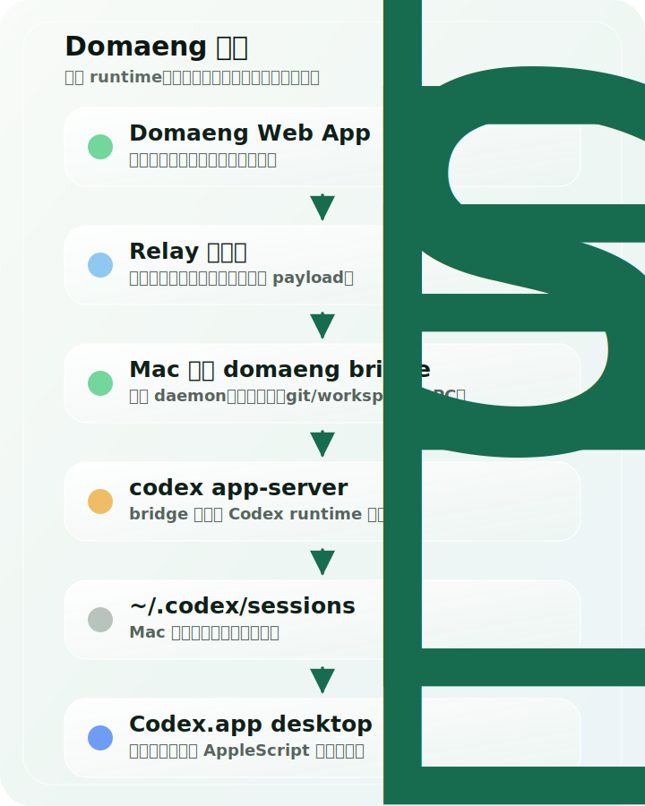

# Domaeng 中文说明



[English README](README.md)

Domaeng 让你从任意配对浏览器控制 [Codex](https://openai.com/index/codex/)，但真正运行 Codex 的地方仍然是你的 Mac。

你的 Mac 是 host。手机、平板、另一台电脑或同一台 Mac 的浏览器，是遥控器。relay 只是传输层。

> **项目还很早期，可能会有 bug。**
>
> 公开仓库以本地运行和自托管为主，不内置私有生产 relay。

## 它是什么

- **Mac-hosted Codex**：Codex、git 操作、workspace 读写和线程历史都留在你的 Mac 上。
- **任意设备 Web App**：iOS、Android、平板、另一台电脑、同一台 Mac，或者安装成 PWA 后都可以用。
- **本地优先连接**：relay 可以本地运行，也可以放在你自己的服务器或私有网络里。
- **一次配对，后续重连**：通过 QR 或配对码信任这台 Mac，之后 bridge 可达时自动重连。

<p align="center">
  
</p>

## 安装

先在负责 host Codex 的 Mac 上安装 bridge CLI：

```sh
npm install -g domaeng@latest
domaeng --version
```

CLI 需要一个 relay URL 才能让浏览器配对。第一次本地跑通时，最适合新手的路径仍然是仓库里的 launcher，因为它会把本地 relay 和 bridge 一起启动：

```sh
git clone https://github.com/hhaajack/domaeng.git
cd domaeng
./run-local-domaeng.sh
```

这一步在负责 host Codex 的 Mac 上运行。launcher 会在需要时安装本地 package 依赖，并打印 Web App 的 URL / QR 配对信息。

在另一台设备上，打开 relay 提供的 `/app/` Web App，然后扫码或输入配对码。

你不需要下载单独的移动端 App。浏览器就是客户端。

## 需要什么

- 一台负责运行 Codex 和 Domaeng bridge 的 Mac
- Node.js 18+
- shell 里能使用 npm、git 和 curl
- Codex CLI 已安装，并且在 `PATH` 里
- 任意能访问你的 relay 或私有网络的设备浏览器

`Codex.app` 是可选的。Domaeng 可以和它共享本地线程历史，但 Web App 是直接控制 bridge。

## 选择你的使用路径

你不需要一上来读完整套文档。先按自己的场景选入口：

| 目标 | 从这里开始 |
| --- | --- |
| 第一次安装并跑通 | [新手入门](Docs/zh-CN/getting-started.md) |
| 手机或平板不在 Mac 同一个 Wi-Fi | [Tailscale 使用说明](Docs/zh-CN/tailscale.md) |
| 从 macOS 状态栏/菜单栏控制 bridge | [菜单栏控制](Docs/zh-CN/menu-bar.md) |
| 看懂每个按钮和操作的含义 | [操作功能说明](Docs/zh-CN/operations.md) |
| 自己运行 relay 或反向代理 | [Self-hosting guide](Docs/self-hosting.md) |
| 查看所有命令和环境变量 | [Advanced reference](Docs/reference.md) |

## 能做什么

- 从 Web App 发起、调整、停止、恢复 Codex run
- 在当前 turn 还在运行时排队后续 prompt
- 观看 Mac-hosted runtime 的实时输出
- 使用 Fast / Standard、Plan mode、reasoning controls、access controls
- 发送图片附件
- 触发本地 git status、commit、push、pull、branch switch 等操作
- 在 turn 完成或需要处理时收到浏览器通知
- 首次配对后，后续自动重连到同一台 trusted Mac

## 工作方式

<p align="center">
  
</p>

1. 在负责 host Codex 的 Mac 上运行 `./run-local-domaeng.sh`，或者在设置了 `DOMAENG_RELAY` 的情况下运行 `domaeng up`。
2. 从任意设备打开 relay 提供的 Web App。
3. 用 QR 或配对码完成一次配对。
4. 浏览器把加密指令发给 Mac bridge。
5. bridge 在 Mac 上调用 Codex，并执行本地 workspace / git 操作。
6. Web App 接收实时输出，之后可以重连到这台 trusted Mac。

## 常见使用路径

### 普通用户

安装 CLI：

```sh
npm install -g domaeng@latest
```

第一次用本地 relay 跑通：

```sh
git clone https://github.com/hhaajack/domaeng.git
cd domaeng
./run-local-domaeng.sh
```

使用 launcher 打印出来的 URL 和 QR。对第一次使用的人来说，这仍然最顺，因为它会替你提供本地 relay。

第一次使用时，可以按 [新手入门](Docs/zh-CN/getting-started.md) 一步一步走。

### 已有 relay

```sh
DOMAENG_RELAY="wss://your-relay.example.com/relay" domaeng up
```

如果你已经有可访问的 relay、Tailscale endpoint 或反向代理，用这条路径。

### 源码 CLI

```sh
git clone https://github.com/hhaajack/domaeng.git
cd domaeng
npm install -g ./phodex-bridge
domaeng up
```

如果你在 checkout 里开发，并且明确想使用源码版本的 `domaeng` 命令，可以用这条路径。

跨设备使用时，Tailscale 或其他稳定私有网络通常比普通 LAN 更顺。详见 [Tailscale 使用说明](Docs/zh-CN/tailscale.md)。

### 自托管 relay

如果你想把 relay 放在自己的 VPS 或私有网络里：

- [Self-hosting guide](Docs/self-hosting.md)
- [Public source model](SELF_HOSTING_MODEL.md)

## 项目结构

| 路径 | 用途 |
| --- | --- |
| `phodex-bridge/` | `domaeng` CLI 背后的 Node.js bridge package |
| `web/` | React + Vite Web/PWA client，由 relay 在 `/app/` 提供 |
| `relay/` | 可自托管 WebSocket relay 和可选 push endpoints |
| `CodexMobile/` | macOS 菜单栏控制源码和共享资源 |
| `Docs/` | 新手指南、操作说明、自托管说明和高级参考文档 |

## 更多细节

首页故意保持简短。需要深入配置时看这里：

- [新手入门](Docs/zh-CN/getting-started.md)：第一次安装、第一次配对、第一次成功控制 Codex
- [Tailscale 使用说明](Docs/zh-CN/tailscale.md)：用私有网络做跨设备访问，不引入硬编码托管服务假设
- [菜单栏控制](Docs/zh-CN/menu-bar.md)：macOS 状态栏/菜单栏控制，以及可直接交给 Codex 的设置 prompt
- [操作功能说明](Docs/zh-CN/operations.md)：Web App、bridge、配对、信任设备和 git 操作分别做什么
- [Advanced reference](Docs/reference.md)：命令、环境变量、安全说明、集成、源码构建
- [Self-hosting guide](Docs/self-hosting.md)：本地 LAN、VPS relay、反向代理、排障
- [Self-hosting model](SELF_HOSTING_MODEL.md)：为什么公开源码保持 local-first 和通用配置

## 当前打包状态

- 公开 npm 包：可以通过 `npm install -g domaeng@latest` 安装
- 源码 launcher：可以通过 `./run-local-domaeng.sh` 使用，适合 all-in-one 本地 relay 路径
- 本地源码 bridge CLI：可以在 checkout 里通过 `npm install -g ./phodex-bridge` 安装
- Web App：由 bridge / relay 在 `/app/` 提供
- 移动端 App：没有单独下载包，使用浏览器或 PWA
- macOS 菜单栏控制：还没有签名的 `.app`、`.dmg` 或 `.zip` GitHub Release；按 [菜单栏控制](Docs/zh-CN/menu-bar.md) 里的 Codex prompt 设置

## 和 Remodex 的关系

Domaeng 基于 [Remodex](https://github.com/Emanuele-web04/remodex) 开发，Remodex 原作者是 Emanuele Di Pietro。

本仓库保留原项目的 Apache-2.0 license 和作者署名，并以 Domaeng 作为当前对外项目名、npm 包名和 app branding 继续维护。上游 Remodex README 说明 Remodex 的名称、标识和 branding 不授权给 fork 或衍生项目使用，所以这个项目对外使用 Domaeng 自己的名称和品牌。

代码里仍然会看到一些 Remodex 时期留下来的名字，例如内部文件名、CLI 入口文件、协议字段，以及 `~/.remodex` 这样的历史状态路径。这些名字是为了兼容已有本地安装、配对状态和迁移路径而保留的，不代表用户需要另外安装 Remodex。

对普通用户来说，需要安装和运行的是 `domaeng`。

## License

Apache-2.0。署名说明见 [NOTICE](NOTICE)。
